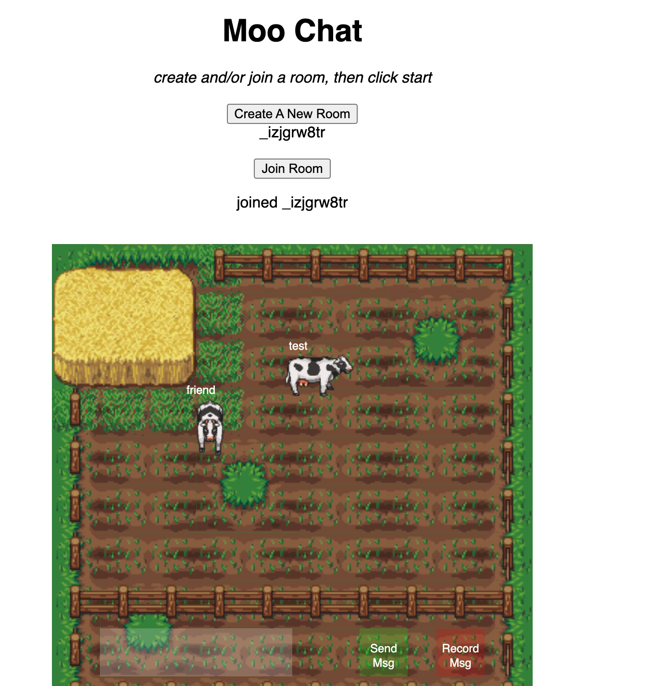

# Moo Chat (formerly Roam)

[playable version](https://desolate-sands-25998.herokuapp.com)

## Overview
Moo Chat is a 2D chat application that allows users to enter rooms (farms) and chat with their friends. 
The application uses speech to text for getting user message input and text to speech for presenting the sent message to other users in a room.
Moo chat uses web sockets (socket io) for near real time movement of user avatars and near real time messaging.

Technologies used are: Node.js, Express, Socket.io, P5.js, Vanilla Javascript

*please use google chrome as your browser when using the chat application*

## Some implementation highlights

### Frontend
The frontend implementation of moo chat uses the p5 library for the application’s canvas and vanilla js for the create and join room logic.

One notable highlight in the frontend is its extensive use of tile sheets. The background is built using multiple different tile sheets. Likewise, the cow animations come from a single tilesheet that is preloaded.

When the cow moves, it checks if an upcoming tile is a fence or stack of hay. If so it is prevented from moving through it.

### Backend

The backend implementation of moo chat uses Node/Express to serve static files. It uses Socket.io (more or less Web Sockets) to create rooms, transmit real-time user data to all members of a room, and send messages between users.

I iterated on my implementation of the backend, first starting with an implementation of sending and receiving user location data, to sending and receiving user objects (adding deserialization of those objects) -- then adding logic for rooms.

